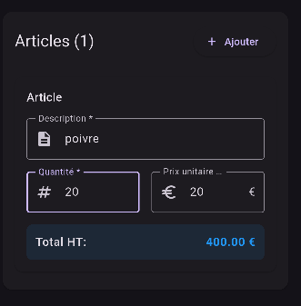
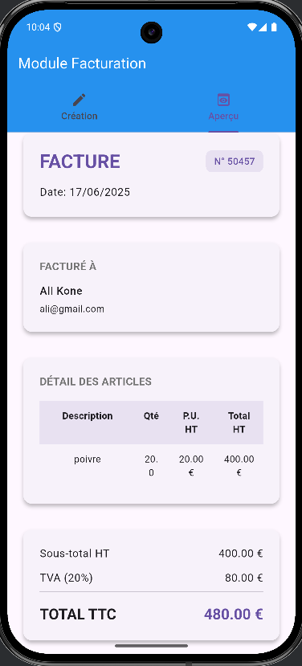
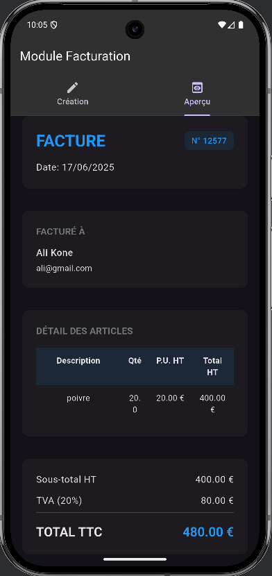
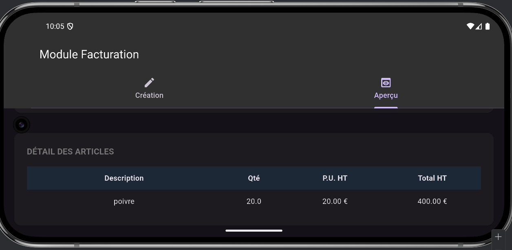

# Module de Facturation Mobile - Flutter

Une application mobile moderne de génération de factures développée avec Flutter, offrant une interface intuitive et des calculs automatiques en temps réel.

## 📱 Aperçu de l'application

### Écran de création de facture
<!-- Insérer capture d'écran de l'écran de création -->


### Gestion des articles
<!-- Insérer capture d'écran de la gestion des articles -->


### Aperçu de la facture
<!-- Insérer capture d'écran de l'aperçu -->


### Mode sombre
<!-- Insérer capture d'écran du mode sombre -->


### Interface responsive
<!-- Insérer capture d'écran en mode paysage -->


## ✨ Fonctionnalités

- ✅ **Création de factures** avec informations client complètes
- ✅ **Gestion dynamique des articles** (ajout/suppression en temps réel)
- ✅ **Calculs automatiques** (HT, TVA 20%, TTC)
- ✅ **Aperçu de facture** avec mise en page professionnelle
- ✅ **Interface responsive** (portrait/paysage)
- ✅ **Thème clair/sombre** automatique selon le système
- ✅ **Validation des formulaires** avec messages d'erreur contextuels
- ✅ **Interface utilisateur moderne** Material Design

## 🏗️ Architecture

### Structure du projet
```
lib/
├── main.dart                 # Point d'entrée de l'application
├── models/
│   ├── article.dart         # Modèle Article avec calculs
│   └── invoice.dart         # Modèle Invoice avec totaux
├── screens/
│   └── invoice_screen.dart  # Écran principal avec navigation
├── widgets/
│   ├── invoice_form.dart    # Formulaire de création
│   ├── article_item.dart    # Composant article réutilisable
│   └── invoice_preview.dart # Aperçu formaté de la facture
└── utils/
    └── validators.dart      # Validation et formatage
```

### Modèles de données

#### Article
```dart
class Article {
  String description;    // Description de l'article
  double quantity;       // Quantité
  double unitPrice;      // Prix unitaire HT
  double get totalHT;    // Calcul automatique: quantité × prix
}
```

#### Invoice
```dart
class Invoice {
  String clientName;     // Nom du client
  String clientEmail;    // Email du client
  DateTime invoiceDate;  // Date de facturation
  List<Article> articles; // Liste dynamique des articles
  
  // Calculs automatiques
  double get totalHT;    // Somme des totaux HT des articles
  double get totalTVA;   // TVA à 20%
  double get totalTTC;   // Total toutes taxes comprises
}
```

## 🚀 Installation et lancement

### Prérequis
- Flutter SDK (≥ 3.0.0)
- Android Studio / VS Code
- Émulateur ou appareil physique

### Installation
```bash
# Cloner le repository
git clone [URL_DU_REPO]
cd invoice_app

# Installer les dépendances
flutter pub get

# Lancer l'application
flutter run
```

## 📋 Fonctionnalités détaillées

### 1. Écran de création de facture

**Informations client:**
- Nom du client (obligatoire)
- Email du client (validation format email)
- Date de facturation (sélecteur de date)

**Gestion des articles:**
- Description de l'article (obligatoire)
- Quantité (validation numérique positive)
- Prix unitaire HT (validation numérique positive)
- Calcul automatique du total HT par article

**Calculs dynamiques:**
- Total HT global
- TVA (20% automatique)
- Total TTC
- Mise à jour en temps réel à chaque modification

### 2. Interface utilisateur moderne

**Composants:**
- Cards avec élévation pour une hiérarchie visuelle claire
- Champs de saisie avec icônes et labels
- Boutons d'action avec feedback visuel
- Navigation par onglets intuitive
- Messages d'état conditionnels

**Responsive Design:**
- Adaptation automatique portrait/paysage
- Layouts optimisés pour différentes tailles d'écran
- Espacements et marges adaptatives

### 3. Validation et feedback

**Validations implémentées:**
- Champs obligatoires
- Format email valide
- Nombres positifs uniquement
- Messages d'erreur contextuels
- Feedback visuel immédiat

### 4. Aperçu professionnel

L'aperçu de facture simule une mise en page professionnelle avec :
- En-tête avec numéro de facture
- Informations client formatées
- Tableau des articles avec colonnes alignées
- Totaux détaillés et mis en évidence
- Design épuré et lisible

### Patterns architecturaux
- **State Management** : setState() simple et efficace
- **Widget composition** : Composants réutilisables
- **Separation of concerns** : Modèles, vues et utilitaires séparés

## 📊 Démonstration d'utilisation

### Workflow typique
1. **Saisie client** : Remplir nom et email
2. **Date** : Sélectionner la date de facturation
3. **Articles** : Ajouter et configurer les articles
4. **Vérification** : Contrôler les calculs automatiques
5. **Aperçu** : Consulter le rendu final

### Exemple de calcul
```
Article 1: 2 × 100€ = 200€ HT
Article 2: 1 × 50€  = 50€ HT
---------------------------------
Total HT:           250€
TVA (20%):          50€
Total TTC:          300€
```

**Développé @0XBOUBA**